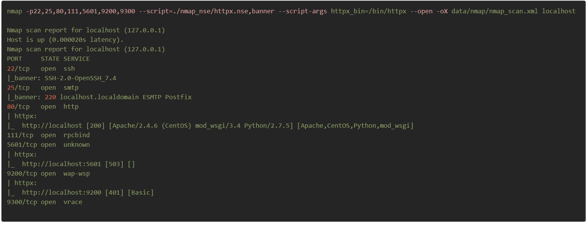
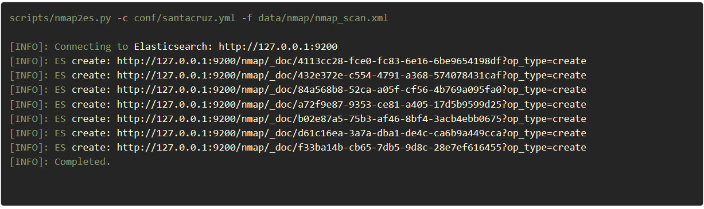
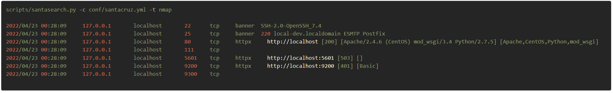
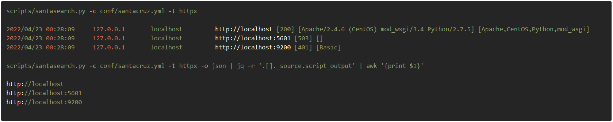

# httpx.nse
This script will run httpx on any open tcp ports discovered during an nmap scan. Why this script? Because it was easier to implement.<br>
see: ```https://github.com/nmap/nmap/issues/2395```

<h3 align="left">
  </a>
</h3>

# Scripts
Helper scripts

| Name  | Description|
| :------------- | :------------- |
| nmap2es.py  | Read nmap XML output, convert to json, and send to Elasticsearch |
| santasearch.py  | Retrieves Elasticsearch data based on tool (nmap, httpx, nuclei, etc..) |

## nmap2es.py
A simple script that will convert Nmap's XML scan results into json and then forwards that data into Elasticsearch. Unfortunately Nmap has yet to implent json output so, we need a script to convert the XML into Json. (c'mon nmap team, it's 2022!)
```yaml
usage: nmap2es.py [-h] -c [config] -f [file] [-i [index]] [-v]
optional arguments:
-h, --help             :- Show this help message and exit
-c, --config [config]  :- Path to configuration file (santacruz.yml)
-f, --file   [file]    :- Path to nmap XML input file
-i, --index  [index]   :- Elasticsearch index (default: nmap)
-v, --verbose          :- Verbose output
```
<h3 align="left">
  </a>
</h3>

## santasearch.py
A simple script to retrieve tool output data from Elasticsearch. Useful for reporting and/or parsing the output for use with other tools. This script reads a configuration file  for elasticsearch as well as any nessesary json queries for stored tool data. See: `conf/santacruz.yml`
```yaml
usage: santasearch.py [-h] -c  [-a] [-l] [-o] [-t] [-s] [-e] [-v]
optional arguments:
  -h, --help      show this help message and exit
  -c , --config   [file]        :- Path to configuration file (santacruz.yml)
  -a , --addr     [ip_addr]     :- Search for IP address
  -l , --limit    [num]         :- Limit number of results (default: 100)
  -o , --output   [format]      :- Output format [tab,csv,json] (default: tab)
  -t , --tool     [name]        :- Search for data based on tool name (default: all)
  -s , --start    [datetime]    :- Search from start datetime
                                   [YYYY/MM/DD HH:MM:SS | now|now-N(d|w|m|h|y)] (default: now-24h)
  -e , --end      [datetime]    :- Search to end datetime
                                   [YYYY/MM/DD HH:MM:SS | now|now-N(d|w|m|h|y)] (default: now)
  -v, --verbose                 :- Verbose output
```
<h3 align="left">
  </a>
</h3>
<h3 align="left">
  </a>
</h3>
Example [datetime] filter formats

|From Start (-s) |To End (-e) | Display|
| :------------- | :------------- |:------------- |
|now       | now |  Today|
|now-15m   | now |  Last 15 minutes|
|now-30m   | now |  Last 30 minutes|
|now-1h    | now |  Last 1 hour|
|now-24h   | now |  Last 24 hours|
|now-1w    | now |  Last week|
|now-7d    | now |  Last 7 days|
|now-30d   | now |  Last 30 days|
|now-90d   | now |  Last 90 days|
|now-1y    | now-15d |  Last 1 year minus 15 days|
|2022/10/03 | 2022/10/08| Oct 03 2022 <-> Oct 08 2022|
|2022/10/17 03:01:22| 2022/11/20 10:02:33| Oct 17 03:01:22 <-> Nov 20 2022 10:02:33|  

</h3>
<h3 align="left">
  </a>
</h3>
